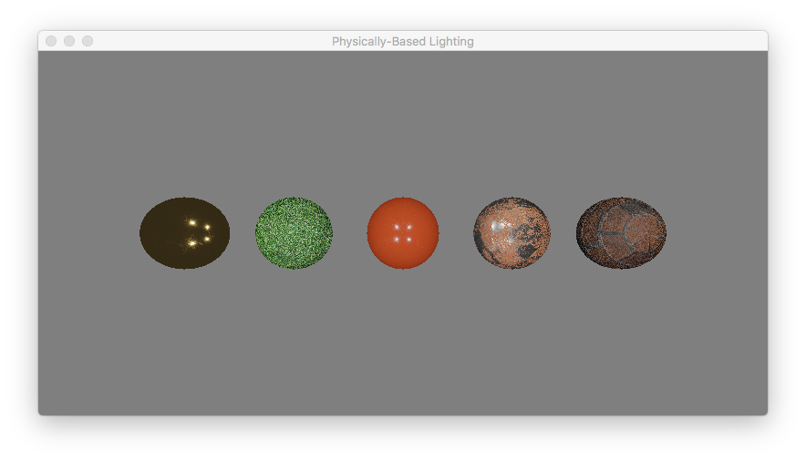

# Physically-Based Rendering with ModelIO.

This project is a port of the demo **pbrLightingTextured** posted at LearnOpenGL.com. It is written in Apple's Swift Language (version 3).

Loading of the meshes and associated texture files are handled by using the methods of Apple's Model I/O framework.

Implementation of the main rendering loop requires matrix and vector operations. These are provided by Apple's GLKit framework. 

The vertex and fragment shaders are a port of those in LearnOpenGL.com's **pbrLightingTextured** demo. 

**Notes:**

Local tangent space calculations can be performed in world space or eye space. If the computations are in world space, the eye/camera's position must be passed as a uniform to the shader(s). On the other hand, if the computations are done in eye space, the camera's position is not passed. The eye's'/camera's position is always at (0.0, 0.0, 0.0). 


**Problem(s):**

On macOS 10.12 or earlier: the **urlValue** property of an instance of **MDLMaterialProperty** returns a NIL. To work around the problem, use the **stringValue** property to load the texture file.


Given below is a window capture of the output rendered by the demo **pbrLightingTextured**. 




**Bug(s)**

Fix a bug in the vertex shader.

```glsl

    worldNormal = normalize(uNormalMatrix * mcNormal);

```

**Requirements:**

Compiled with XCode 8.3.2 running under macOS 10.12 (Sierra)


